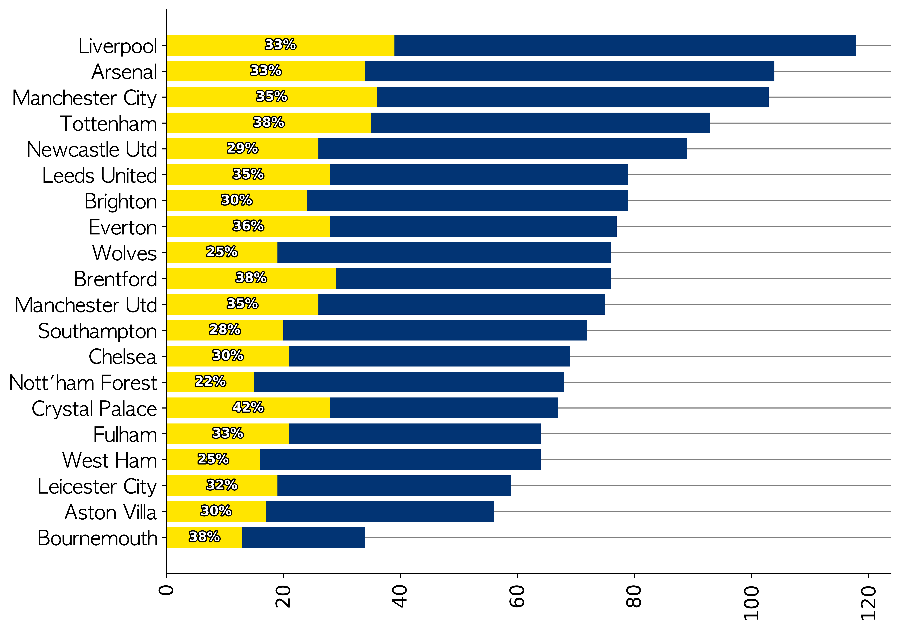
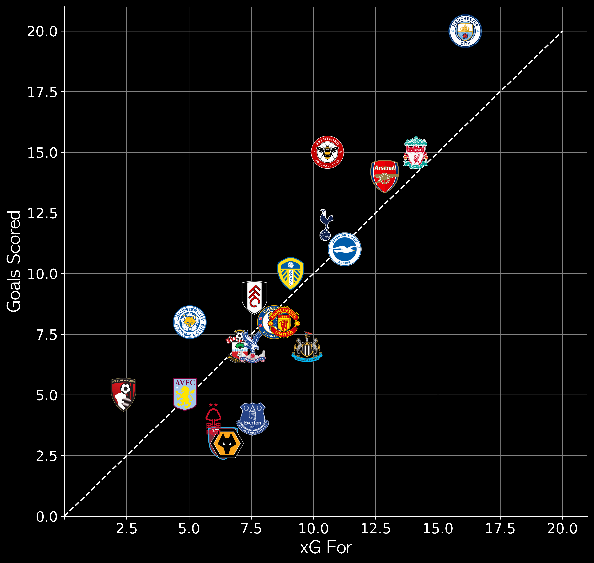
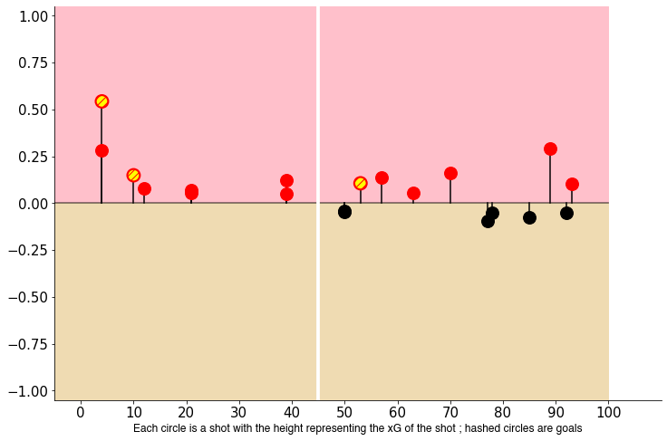

# Football Data Analytics
Collection of my football data analytics work that I showcase on twitter.
Most of the code and concepts that I have learned in this field has been from the amazing resources provided by the football data analytics community.

## Contents

  
Table of Contents

  <ol>
    <li><a href="#introduction"> ➤ Introduction</a></li>
    <li><a href="#folder-structure"> ➤ Folder Structure</a></li>
    <li><a href="#workflow"> ➤ Workflow</a></li>
    <li>
      <a href="#projects"> ➤ Projects</a>
      <ul>
        <li><a href="#11---bars-shot-on-target">11 -Bar , Shots (On target %)</a></li>
        <li><a href="#13---xG-vS-g">13-xG VS G</a></li>
        <li><a href="#18---touch-locations">18- Touch Locations</a></li>
        <li><a href="#22---goals-timeline">22-Goals Timeline</a></li>
        <li><a href="#23---long-goalkicks">23- % Long Goalkicks</a></li>
        <li><a href="#42---sOT">42-SOT</a></li>
        <li><a href="#9---xG-lollipop">9-xG Lollipop</a></li>
      </ul>
    </li>
  </ol>

## Introduction
This repository contains a projects that are used to generate posts for my Twitter Account.Python is used for extraction,scraping,data pre-processing, analysis and visualisation. Libraries used are beautiful soup,matplotlib,pandas etc. These mini projects have helped me to understand data better and apply it to my field of interest which is Football. Check out my Twitter [(@Ligandro22_)](https://twitter.com/Ligandro22).

## Folder Structure

    Football-Viz-for-Twitter
    │
    ├── Projects
    │   ├── 11-Bar , Shots (On target %).ipynb
    |   ├── 13-xG VS G.ipynb
    |   ├── 18- Touch Locations.ipynb
    |   ├── 22-Goals Timeline.ipynb
    |   ├── 23- % Long Goalkicks .ipynb
    |   ├── 34-xT 2.ipynb
    |   ├── 42-SOT.ipynb
    |   ├── 9-xG Lollipop.ipynb
    │ 
    │ 
    ├── README.md 

## Workflow

As shown in the folder structure above, the repository contains three key folders:
- **images**: final vizzes
- **projects**: List of projects that cover various elements of football data analytics for Twitter.

## Projects

### 11 - Bars Shot On Target

**Summary**: Use Fbref data to plot bars of shots taken by the 20 Premier League clubs in a season. Also shown is the percentage of shots on target. Good teams take a high no of shots and have a good percentage of them on target. Not a decisive measure of a team's attacking prowess but still provides a good statistical view.

   &nbsp &nbsp

### 13 - xG VS G
**Summary:** Scrape team shooting data from Fbref.com . Get xG,xGA,Goals Scored and Goals Conceded for the 20 Premier League Teams.xG and xGA are expected goals scored and expected goals conceded respectively. Comparing these two metrics with actual goals scored and conceded gives a performance measure of teams in the league. If the team scored more goals than expected it is said to be performing well. If less goals are conceded than expected then it is said to be performing better too. 

   &nbsp &nbsp

### 18 - Touch Locations

**Summary:** Scrape touches data from Fbref. Get total touches in final 3rd,Mid 3rd and Defensive 3rd for all 20 Premier League teams. Plot the numbers on mplsoccer pitch. Denote pitch areas by colour and annotate touches.

   &nbsp &nbsp

### 22 - Goals Timeline

**Summary:** Get Arsenal Team Data from Understat and plot no of goals scored and conceded distributed over the 90mins divided into 15 min brackets.
This helps us see when Arsenal tend to scored and concede during a time period in a match.

   &nbsp &nbsp 

### 23 - Long Goalkicks

**Summary:** Plot bars of the percentage of long goalkicks taken by each team in the Premier League.Helps us get an insight on how teams tend to build up play.

   &nbsp &nbsp 

### 42 - SOT

**Summary:** Compare Shots on Target taken and conceded by teams in the Premier League using scatter plot.Good teams take SOT Taken and concede less SOT 

   &nbsp &nbsp 

### 9 - xG Lollipop

**Summary:** Plot shots taken in a match and xG of each shot accoring to time in match. Helps us see when teams are dominating in attack in a time period in match.

   &nbsp &nbsp 

