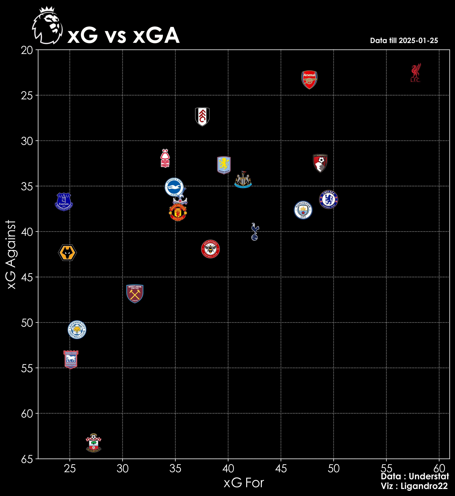
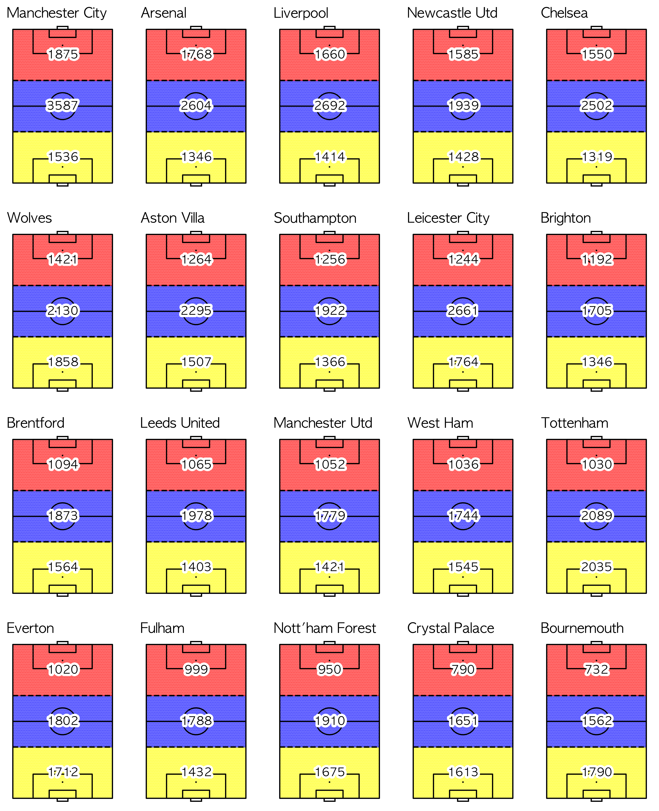
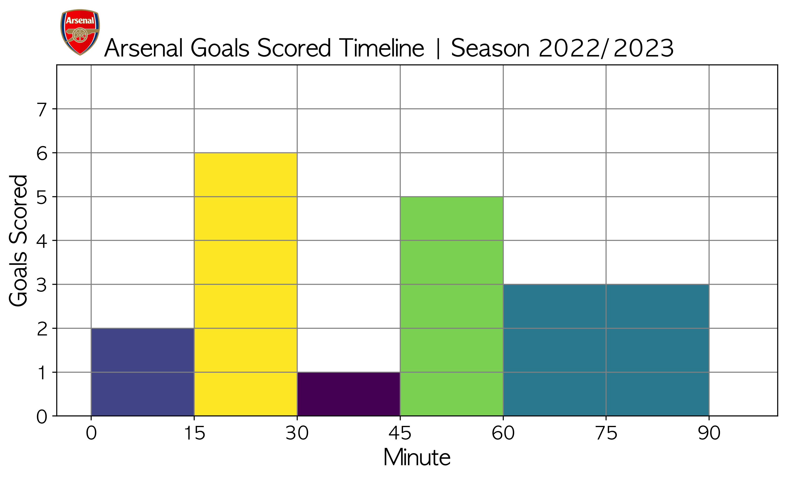
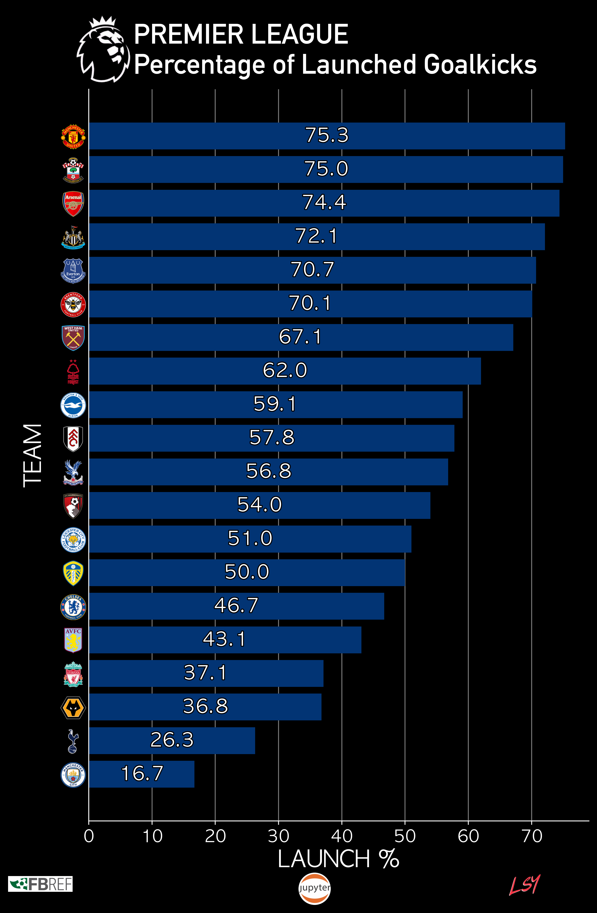
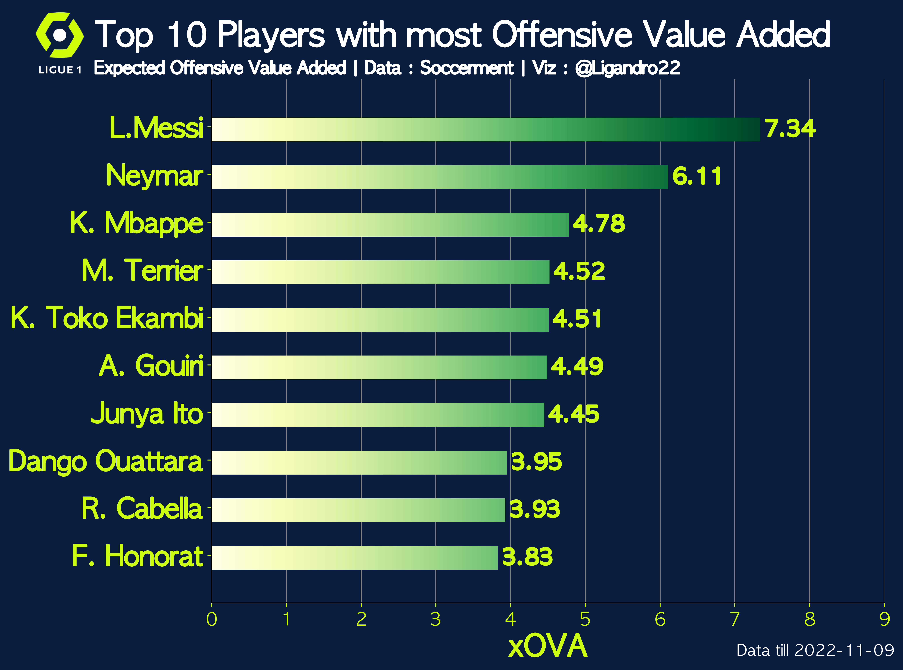
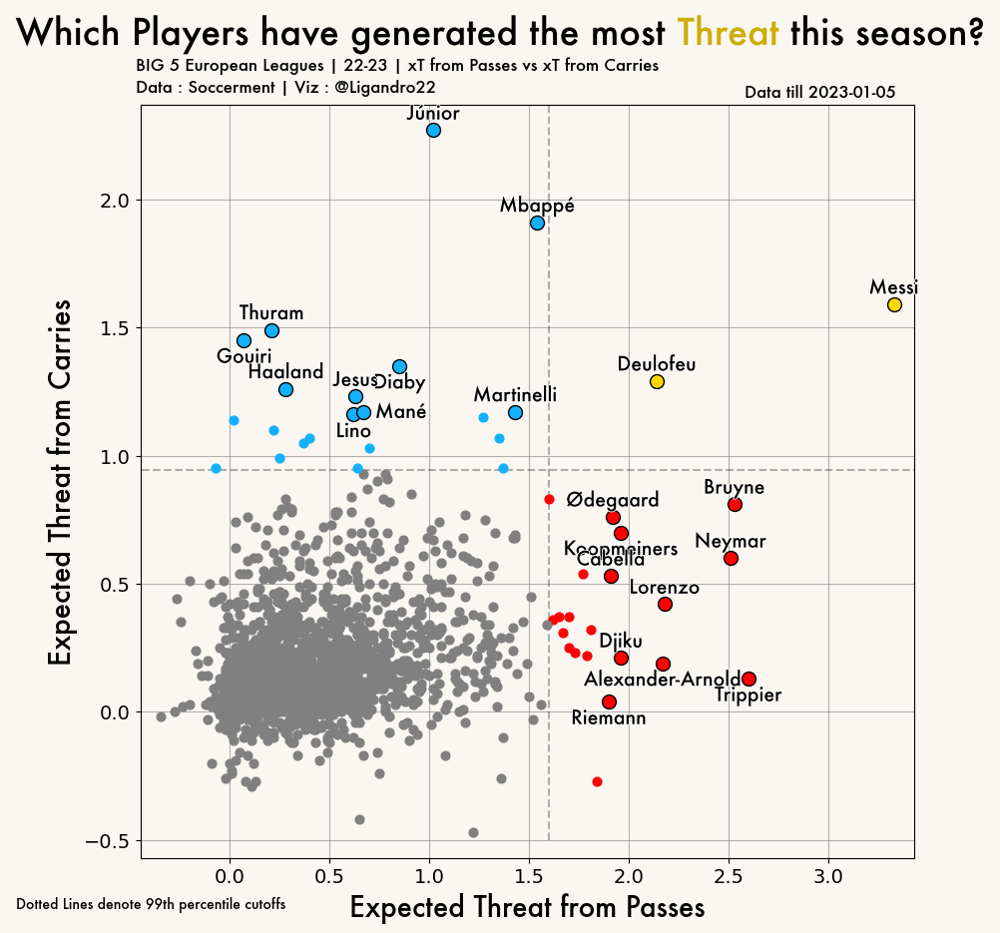
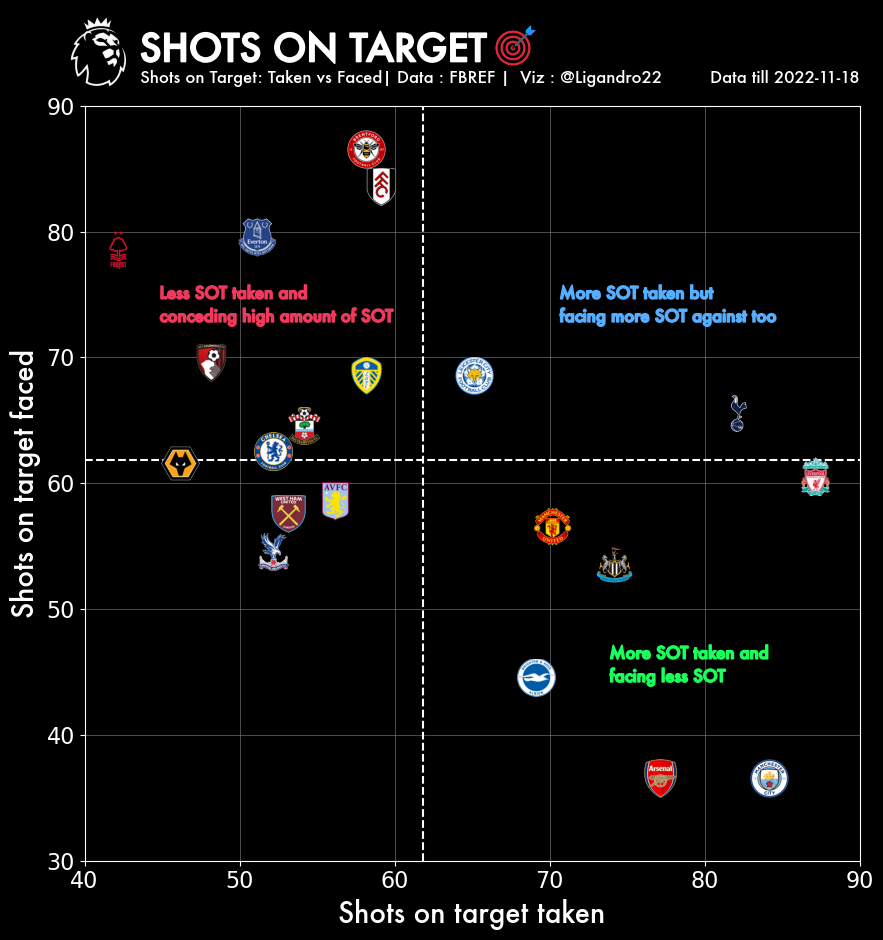
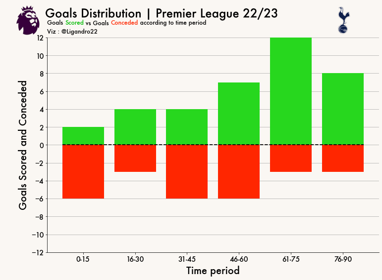

# Football Data Analytics
Collection of my football data analytics work that I showcase on twitter.
- I started looking into Football Data Analysis as a way to practise my Python and Data Analysis skill when I was in my undergrad. It helped me develop my coding skills and allowed me to explore more about the sport I love the most. Most of the code and concepts that I have learned in this field has been from the amazing resources provided by the football data analytics community. You can use these to practise your skills and make your own visualisations. 

## Contents

  
Table of Contents

  <ol>
    <li><a href="#introduction"> ➤ Introduction</a></li>
    <li>
      <a href="#Work"> ➤ Work</a>
      <ul>
        <li><a href="#1---scraping-from-understat">1 - Scraping from Understat</a></li>
        <li><a href="#2---xG-vS-xAG">2-xG VS xAG</a></li>
        <li><a href="#3---touch-locations">18- Touch Locations</a></li>
        <li><a href="#4---goals-timeline">22-Goals Timeline</a></li>
        <li><a href="#5---long-goalkicks">23- % Long Goalkicks</a></li>
        <li><a href="6---oVA">33-OVA</a></li>
        <li><a href="#7---xT">34-xT 2</a></li>
        <li><a href="#8---sOT">42-SOT</a></li>
        <li><a href="#9---gD-time">53-GD Time</a></li>
      </ul>
    </li>
  </ol>

## Introduction
This repository contains a projects that are used to generate posts for my Twitter Account.Python is used for extraction,scraping,data pre-processing, analysis and visualisation. Libraries used are beautiful soup,matplotlib,pandas etc. These mini projects have helped me to understand data better and apply it to my field of interest which is Football. Check out my Twitter [(@Ligandro22_)](https://twitter.com/Ligandro22).

## Work

### 1 - Scraping from Understat

**Summary**: Get match related Data from Understat using Beautiful Soup and then preprocessing data using Pandas

### 2 - xG VS xAG
**Summary:** Get Premier league Data from Understat for the current season. Get xG and xGA for the 20 Premier League Teams. xG and xGA are expected goals scored and expected goals conceded respectively. Create a scatter plot using these two metrics.

   &nbsp &nbsp

### 3 - Touch Locations

**Summary:** Scrape touches data from Fbref. Get total touches in final 3rd,Mid 3rd and Defensive 3rd for all 20 Premier League teams. Plot the numbers on mplsoccer pitch. Denote pitch areas by colour and annotate touches.

   &nbsp &nbsp

### 4 - Goals Timeline

**Summary:** Get Arsenal Team Data from Understat and plot no of goals scored and conceded distributed over the 90mins divided into 15 min brackets.
This helps us see when Arsenal tend to scored and concede during a time period in a match.

   &nbsp &nbsp 

### 5 - Long Goalkicks

**Summary:** Plot bars of the percentage of long goalkicks taken by each team in the Premier League.Helps us get an insight on how teams tend to build up play.

   &nbsp &nbsp 

### 6 - OVA

**Summary:** Bars of top 10 players with highest offensive value added in Ligue 1

   &nbsp &nbsp 

### 7 - xT

**Summary:** Scatter Plot of players in Europe's Big 5 Leagues with x axis representing threat from passses and y axis representing threat from carries.

   &nbsp &nbsp 

### 8 - SOT

**Summary:** Compare Shots on Target taken and conceded by teams in the Premier League using scatter plot.Good teams take SOT Taken and concede less SOT 

   &nbsp &nbsp 

### 9 - GD Time
 Comparing these two metrics with actual goals scored and conceded gives a performance measure of teams in the league. If the team scored more goals than expected it is said to be performing well. If less goals are conceded than expected then it is said to be performing better too. 

**Summary:** Distribution of goals scored and conceded for a PL Team according to 15 min time scales

   &nbsp &nbsp 

