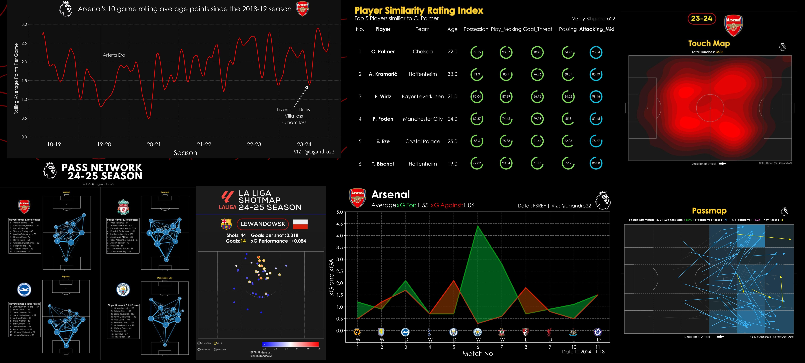
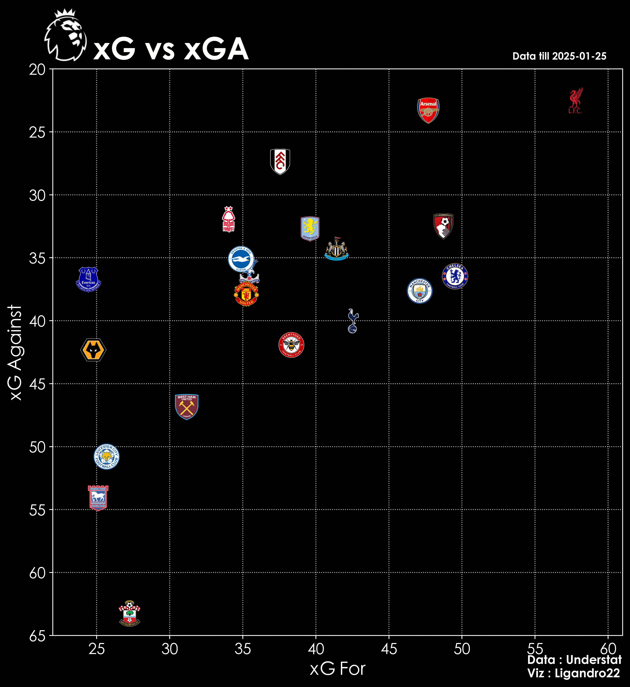
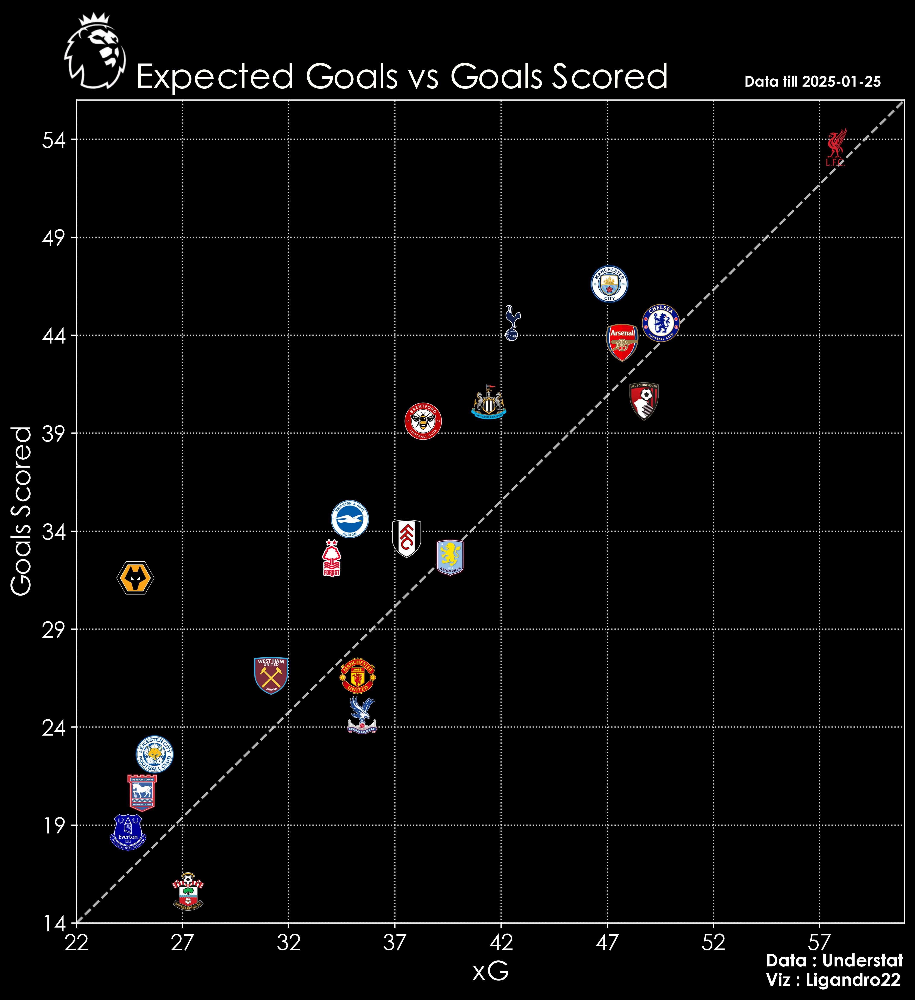
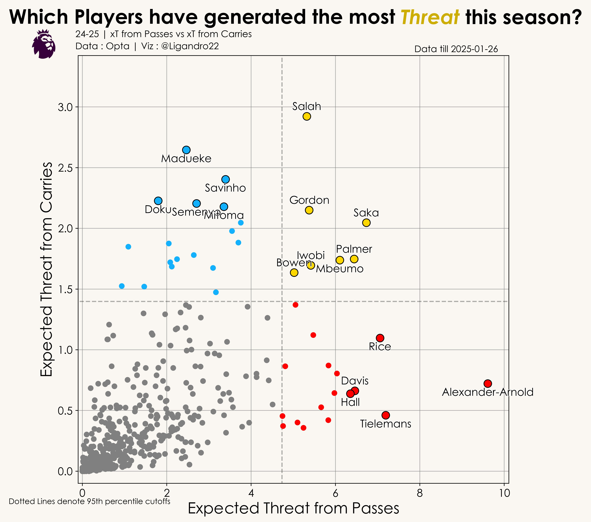
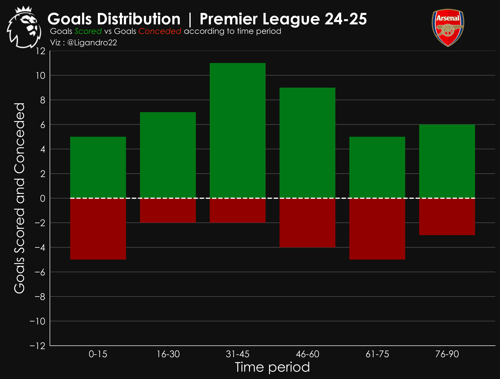
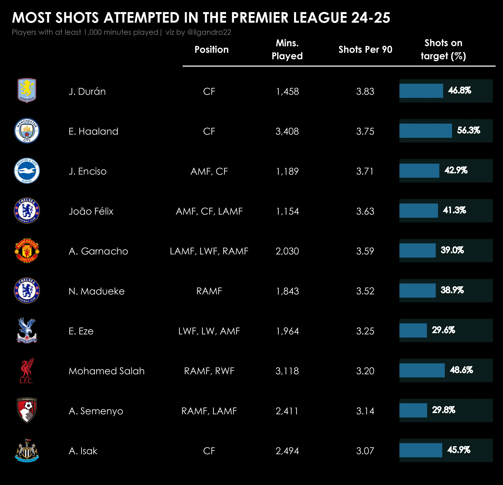
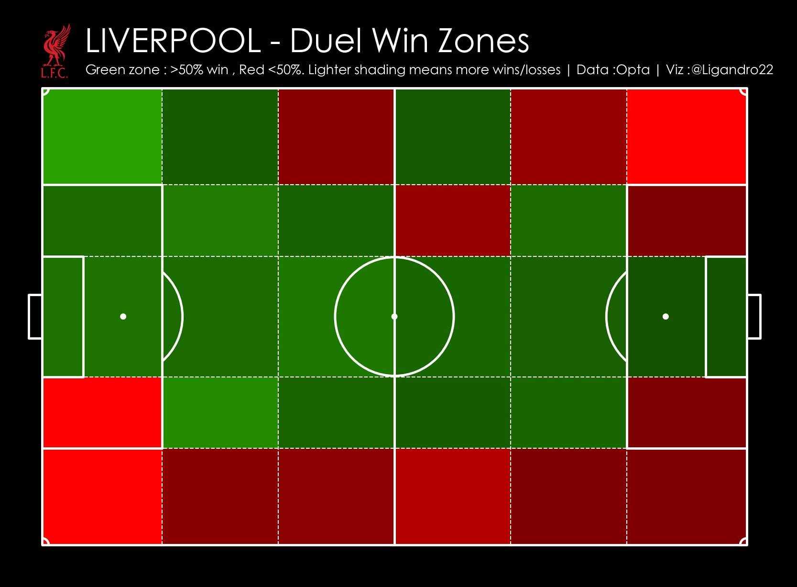
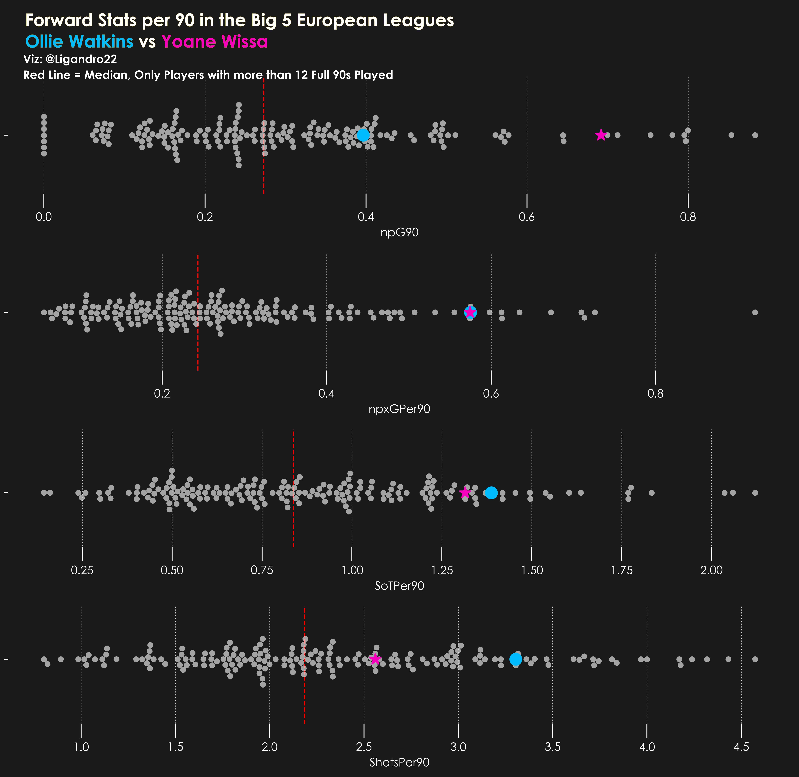
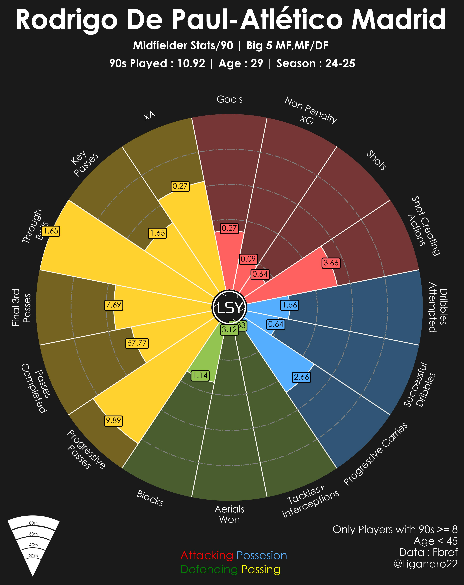
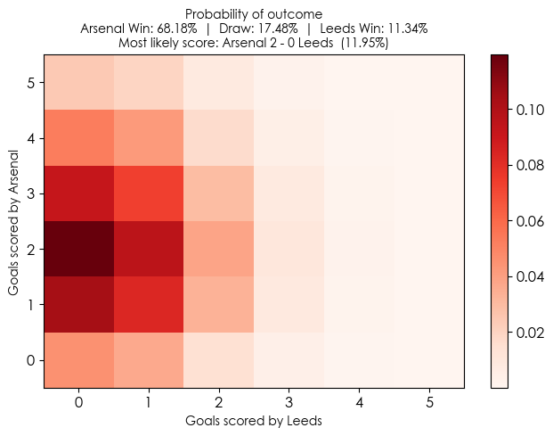

# Football Data Analytics
- I started looking into Football Data Analysis as a way to practise my Python and Data Analysis skills when I was in my undergrad. It helped me develop my coding skills and and apply it to my field of interest which is Football. Most of the code and concepts that I have learned in this field has been from the amazing resources provided by the football data analytics community. I have included code of some selected vizzes. Check out more of my on Twitter [(@Ligandro22_)](https://twitter.com/Ligandro22).

   &nbsp &nbsp

## Contents

  
Table of Contents

  <ol>
    <li><a href="#introduction"> ➤ Introduction</a></li>
    <li>
      <a href="#work"> ➤ Work</a>
      <ul>
        <li><a href="#1---scraping-from-understat">1 - Scraping from Understat</a></li>
        <li><a href="#2---xg-vs-xag">2 - xG vs xAG</a></li>
        <li><a href="#3---xg-vs-g">3 - xG vs G</a></li>
        <li><a href="#4---xt-prem">4 - xT Prem</a></li>
        <li><a href="#5---gd-time">5 - GD Time</a></li>
        <li><a href="#6---stats-table">6 - Stats Table</a></li>
        <li><a href="#7---duel-zones">7 - Duel Zones</a></li>
        <li><a href="#8---beeswarm-comparasion">8 - Beeswarm Comparasion</a></li>
        <li><a href="#9---player-radar">9 - Player Radar</a></li>
      </ul>
    </li>
    <li>
      <a href="#computer-vision-projects"> ➤ Computer Vision Projects</a>
      <ul>
        <li><a href="#roboflow">Roboflow</a></li>
      </ul>
    </li>
  </ol>

## Introduction
Python is used for extraction,scraping,data pre-processing, analysis and visualisation. Libraries used are beautiful soup,matplotlib,pandas etc. If you are not familiar with coding, I would highly suggest you to learn Python,Pandas,Matplotlib and some basic web scraping from youtube. After that you will find my code intuitive. 

## Work

### 1 - Scraping from Understat
**Notebook:** `Projects/Notebooks/1-Scraping from Understat.ipynb`
**Summary:** Get match related Data from Understat using Beautiful Soup and preprocess using Pandas.

### 2 - xG vs xAG
**Notebook:** `Projects/Notebooks/2-Xg vs Xag.ipynb`
**Summary:** Get Premier League data for the current season, calculate xG and xGA for all teams, and visualize with a scatter plot.

   &nbsp;&nbsp;

### 3 - xG vs G
**Notebook:** `Projects/Notebooks/3-xG VS G.ipynb`
**Summary:** Compare expected goals (xG) with actual goals (G) for all teams to measure performance.

   &nbsp;&nbsp;

### 4 - xT Prem
**Notebook:** `Projects/Notebooks/4-xT Prem.ipynb`
**Summary:** Scatter plot of players with x-axis as threat from passes and y-axis as threat from carries.

   &nbsp;&nbsp;

### 5 - GD Time
**Notebook:** `Projects/Notebooks/5-GD Time.ipynb`
**Summary:** Distribution of goals scored and conceded for a PL team in 15-min intervals. Data from Soccerstats.

   &nbsp;&nbsp;

### 6 - Stats Table
**Notebook:** `Projects/Notebooks/6-Stats Table.ipynb`
**Summary:** Table showing the top 10 players for any stat.

   &nbsp;&nbsp;

### 7 - Duel Zones
**Notebook:** `Projects/Notebooks/7-Duel Zones.ipynb`
**Summary:** Pitch zone plot to visualize areas where a team is dominant in duels.

   &nbsp;&nbsp;

### 8 - Beeswarm Comparasion
**Notebook:** `Projects/Notebooks/8-Beeswarm Comparasion.ipynb`
**Summary:** Beeswarm plot to compare stats between two players.

   &nbsp;&nbsp;

### 9 - Player Radar
**Notebook:** `Projects/Notebooks/9-Player Radar.ipynb`
**Summary:** Position-wise radar for player stats.

   &nbsp;&nbsp;

### 10- Poisson Match Simulation 
**Notebook:** `Projects/Notebooks/10-plot_SimulateMatches.ipynb`
**Summary:** Simulate football match results using a Poisson regression model.

   &nbsp;&nbsp;

---

## Computer Vision Projects

### Roboflow
**Location:** `Projects/Computer Vision/Roboflow/`
- Notebooks: `Api.ipynb`, `football_ai.ipynb`, `train_player_detector.ipynb`

