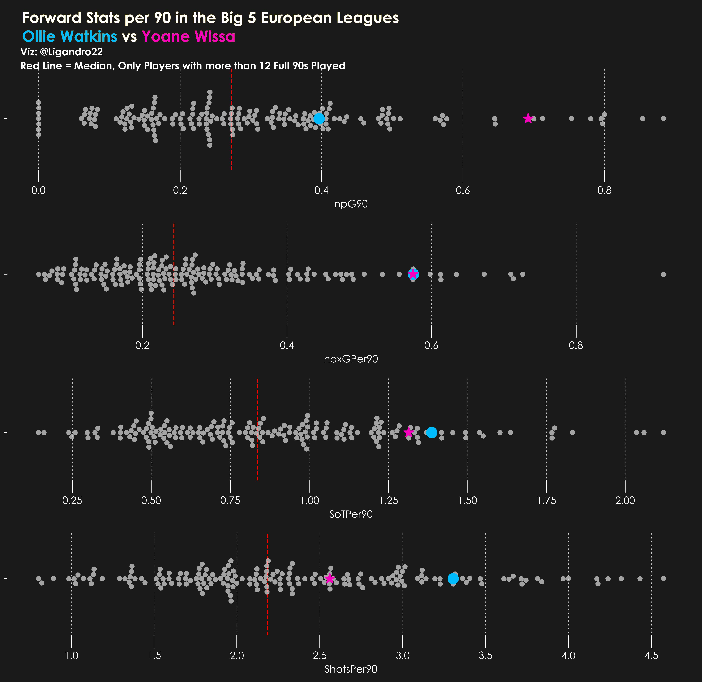

# Football Data Analytics
Collection of my football data analytics work that I showcase on twitter.
- I started looking into Football Data Analysis as a way to practise my Python and Data Analysis skill when I was in my undergrad. It helped me develop my coding skills and allowed me to explore more about the sport I love the most. Most of the code and concepts that I have learned in this field has been from the amazing resources provided by the football data analytics community. You can use these to practise your skills and make your own visualisations. 

## Contents

  
Table of Contents

  <ol>
    <li><a href="#introduction"> ➤ Introduction</a></li>
    <li>
      <a href="#Work"> ➤ Work</a>
      <ul>
        <li><a href="#1---scraping-from-understat">1 - Scraping from Understat</a></li>
        <li><a href="#2---xG-vS-xAG">2-xG VS xAG</a></li>
        <li><a href="#3---xG-vS-g">3 - xG VS G</a></li>
        <li><a href="#4---xT">4-xt</a></li>
        <li><a href="#5---gD-time">5-GD Time</a></li>
        <li><a href="#6---stats-table">6-Stats Table</a></li>
        <li><a href="#7---duel-zones">7-Duel Zones</a></li>
        <li><a href="#8---beeswarm-comparision">8-Beeswarm Comparision</a></li>
      </ul>
    </li>
  </ol>

## Introduction
This repository contains a projects that are used to generate posts for my Twitter Account.Python is used for extraction,scraping,data pre-processing, analysis and visualisation. Libraries used are beautiful soup,matplotlib,pandas etc. These mini projects have helped me to understand data better and apply it to my field of interest which is Football. Check out my Twitter [(@Ligandro22_)](https://twitter.com/Ligandro22).

## Work

### 1 - Scraping from Understat

**Summary**: Get match related Data from Understat using Beautiful Soup and then preprocessing data using Pandas

### 2 - xG VS xAG
**Summary:** Get Premier league Data from Understat for the current season. Get xG and xGA for the 20 Premier League Teams. xG and xGA are expected goals scored and expected goals conceded respectively. Create a scatter plot using these two metrics.

   &nbsp &nbsp

### 3 - xG VS G
**Summary:** Get Premier league Data from Understat for the current season. Get xG and G for the 20 Premier League Teams. Comparing expected goals with actual goals scored gives a performance measure of teams in the league. If the team scored more goals than expected it is said to be overperforming which is considered as good.

   &nbsp &nbsp

### 4 - xT

**Summary:** Scatter Plot of players in the Premier League with x axis representing threat from passses and y axis representing threat from carries.

   &nbsp &nbsp 

### 5- GD Time

**Summary:** Distribution of goals scored and conceded for a PL Team according to 15 min time scales. Data from Soccerstats

   &nbsp &nbsp 

### 6 - Stats Table

**Summary:** Create a table showing the top 10 players for any stat

   &nbsp &nbsp 

### 7 - Duel Zones

**Summary:** Create a pitch zone plot to see in which areas of the pitch a team is dominant in winning duels. 

   &nbsp &nbsp 

### 8 - Beeswar Comparision

**Summary:** Create a beeswarm plot to compare stats among two players.

   &nbsp &nbsp 

